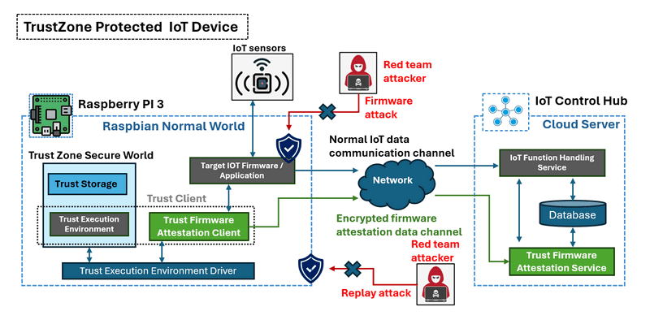
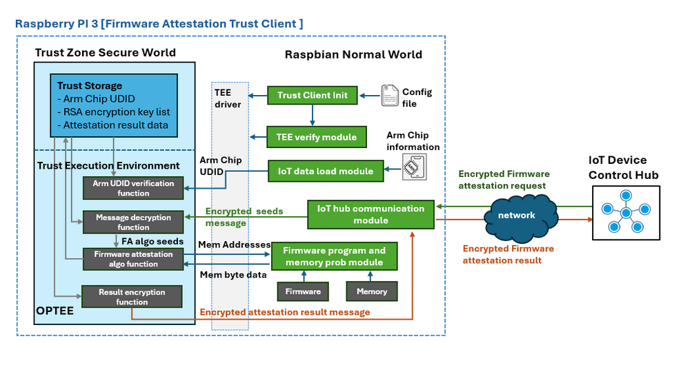
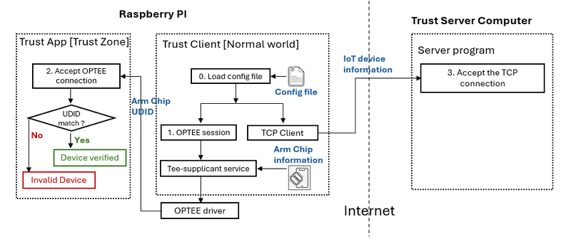
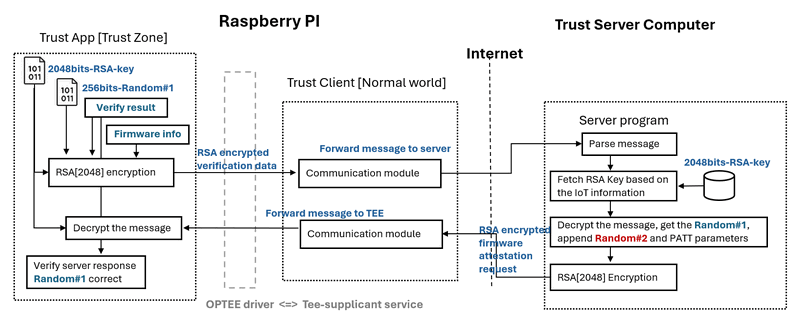
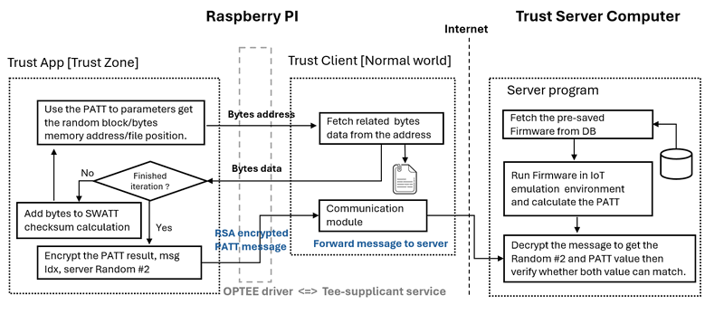
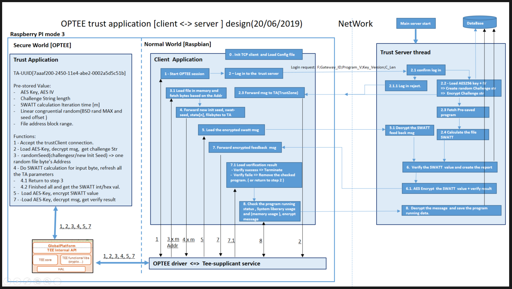
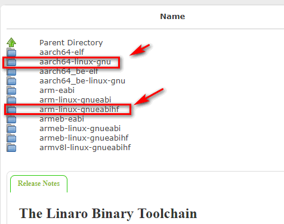
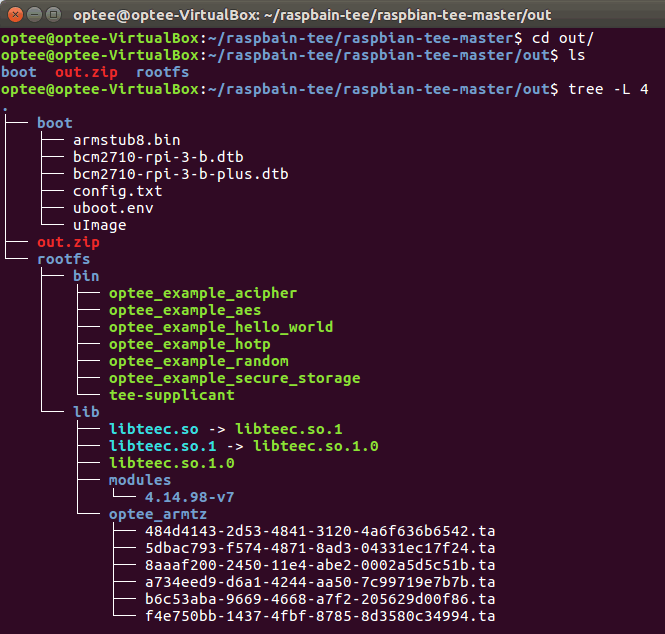
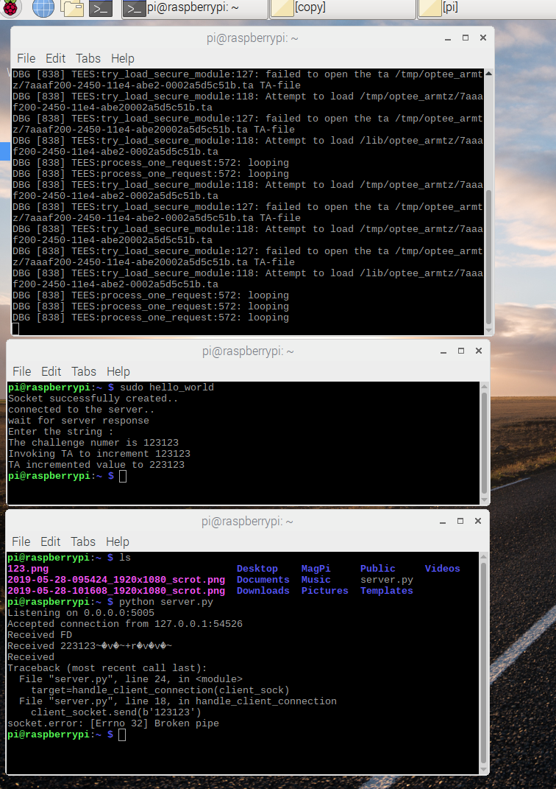

# Trust Zone/Env (OPTEE) on Raspberry PI
**Project Design**: The primary goal of this project is to utilize the Raspberry Pi as the foundation platform for constructing a secure "Trust IoT device", employing ARM TrustZone technology to protect critical data such as encryption keys for communication channels and IoT firmware attestation program from potential information leaks and firmware attacks. To achieve this, we will develop a "Trust Client" program and utilize the [OPTEE (Open Portable Trusted Execution Environment)](https://www.trustedfirmware.org/projects/op-tee/) library to establish a Trusted Execution Environment (TEE) on the Raspberry Pi 3+. The Trust functions will run within this TEE to ensure security. The firmware attestation code will be integrated into a trust function running within the TrustZone, to verify the integrity of the executable firmware on the IoT device (Raspberry Pi Model 3).

The system consists of two primary components:

- **Trust Firmware Attestation Server**: This server program operates on the IoT control hub (cloud) side. It is responsible for transmitting encrypted PATT (Physics-based Attestation) requests and parameters to the corresponding Trust Client. Subsequently, it verifies the response from the Trust Client to determine if the IoT device has been compromised.

- **Trust Firmware Attestation Client**: The Trust Client program is deployed on the IoT device (Raspberry Pi) and operates within both the Normal World and the TrustZone. The communication module in the Normal World forwards encrypted messages from the Trust Firmware Attestation Server to the secure world function. Subsequently, it performs the PATT check for the target Firmware/Application program based on the server's request. Upon completion, the Trust Client sends the encrypted result back to the server for verification.

The System overview is shown below:



```
version:     v0.1.2
Copyright:   Copyright (c) 2021 LiuYuancheng
License:     MIT License  
```


**Table of Contents**

[TOC]

------

### Introduction 

With the advancement of reverse engineering techniques, hackers can easily extract part of source code from Linux-based IoT devices by dissecting the application type firmware files. For instance, consider a scenario where we utilize pyInstaller to compile our CV analysis program into a executable file on Raspbian OS, and deploy it on a Raspberry Pi to create a motion detection camera. If a hacker obtains such a camera, they can employ tools like pyinstxtractor to unpack the firmware and then use uncompyle6 to decompile it, thereby gaining access to some part of the source code. Subsequently, armed with this knowledge, they can craft malicious firmware programs to launch attacks. Even if we incorporate a firmware attestation program in our IoT devices, hackers can also attempt to decompile it to identify the vulnerabilities and bypass security measures.

To mitigate these risks, we propose relocating the critical functions (such as the firmware attestation logic) to the Raspberry Pi's ARM TrustZone. By doing so, we render the attestation program immune to decompilation attempts by hackers. Additionally, we will securely store the Arm chip's unique `Device identification UDID` and our attestation message RSA encryption key within the TrustZone. The ARM chip verification program operating within the TrustZone will retrieve the ARM's `Device identification UDID` and compare it with stored records. If they do not match, the attestation process will fail. So, even if a hacker clones all components onto another Raspberry Pi, they will be unable to execute a replay attack.

Furthermore, the attestation result will be encrypted within the trust environment using the encryption key stored in the TrustZone. This ensures that even if hackers intercept communication between the IoT hub server and the device, they will be unable to decrypt the messages and launch a Man-in-the-Middle (MITM) attack. 

The general trust client workflow is shown below:



The Trust Client program on the Raspberry Pi consists of three key sections:

- **Normal World Program**: This segment operates within the Application level Normal World, handling most program functions, facilitating the transmission of information to the IoT control Hub, and passing data to the trust function in the Secure World.
- **Trust Storage Constants**: All critical information and parameters, such as firmware attestation results, Device identification UDID, and RSA encryption keys, will be stored as constants in the Secure World for the trust function's usage.
- **Trust Execution Functions**: This component operates within the Secure World, containing essential secure function code, such as message RSA encryption, Arm chip UDID verification code, and the attestation algorithm function, to mitigate the risk of reverse engineering attacks.


------

### Background Knowledge


#### ARM Trust Zone

TrustZone is a technology developed by ARM Holdings that provides hardware-based security features on ARM-based processors. It creates two separate execution environments: the "Normal World" and the "Secure World". These environments run concurrently on the same processor, but with different levels of access and privileges. Each world operates independently, with its own set of resources, privileges, and execution environments. Here's a basic overview of how ARM TrustZone works:

1. **Normal World**: This is where the regular operating system (such as Android, Linux, or other RTOS) runs along with user applications. It operates in a non-secure state and has access to regular resources and memory.
2. **Secure World**: This is a separate, isolated environment that runs a trusted operating system, often called a "Secure Monitor" or "Secure Kernel". The Secure World has higher privileges and access to secure resources such as cryptographic functions, secure storage, and secure boot mechanisms. It ensures that critical system functions and sensitive data are protected from unauthorized access or tampering.

TrustZone technology enables secure boot, secure storage, secure communication channels, and secure execution environments for applications that require high levels of security, such as mobile payment systems, digital rights management (DRM), and enterprise security solutions. It provides a foundation for building trusted execution environments (TEEs) where sensitive operations can be performed with a high degree of assurance against attacks.

Reference: https://www.arm.com/technologies/trustzone-for-cortex-m#:~:text=Arm%20TrustZone%20technology%20is%20used,to%20as%20the%20secure%20monitor


#### Trust Execution Environment and OP-TEE

**Trusted Execution Environment (TEE)**: The Trusted Execution Environment (TEE) is a secure area within the TrustZone environment where trusted applications can run with higher levels of security and confidentiality. TrustZone divides the ARM processor into two separate worlds: Normal World and Secure World. The TEE is  a secure execution environment for running critical security functions and trusted applications in the Secure World. It is a trusted operating environment that provides isolation and protection for sensitive operations and applications. TEE offers a secure runtime environment where trusted applications, such as secure payment solutions, digital rights management (DRM) systems, and secure authentication mechanisms, can run with confidentiality, integrity, and reliability.

In essence, TrustZone provides the hardware support necessary to create a secure execution environment, while the TEE utilizes this environment to run trusted applications and execute critical security functions. The TEE leverages the security features provided by TrustZone, such as hardware isolation, secure boot, secure storage, and secure communication channels, to ensure the confidentiality and integrity of sensitive data and operations.

OP-TEE is a Trusted Execution Environment (TEE) designed as companion to a non-secure Linux kernel running on Arm; Cortex-A cores using the TrustZone technology. OP-TEE implements TEE Internal Core API v1.1.x which is the API exposed to Trusted Applications and the TEE Client API v1.0, which is the API describing how to communicate with a TEE. Those APIs are defined in the GlobalPlatform API specifications.

Reference: https://www.trustedfirmware.org/projects/op-tee/


#### How TrustZone Ensures Security

Accessing data stored in the TrustZone storage is highly challenging for hackers due to the robust security mechanisms in place. TrustZone provides hardware-enforced isolation between the Normal World and the Secure World, ensuring that data stored in the Secure World is protected from unauthorized access.

Here are some reasons why it's difficult for a hacker to access data saved in the TrustZone storage:

1. **Hardware Isolation**: TrustZone utilizes hardware-enforced isolation mechanisms to separate the Normal World and the Secure World. This prevents code running in the Normal World from directly accessing or tampering with data stored in the Secure World.
2. **Secure Boot**: TrustZone supports secure boot mechanisms, ensuring that only authenticated and trusted code can be loaded and executed in the Secure World. This prevents unauthorized code from accessing data stored in the TrustZone storage.
3. **Secure Storage**: Data stored in the TrustZone storage is encrypted and protected by cryptographic algorithms. Even if a hacker manages to gain access to the physical memory, they would still need to decrypt the data, which is typically challenging without the appropriate cryptographic keys.
4. **Secure Monitor**: The Secure Monitor, a trusted piece of firmware responsible for managing transitions between the Normal World and the Secure World, helps ensure the integrity and security of data stored in the TrustZone storage.

While it's theoretically possible for sophisticated attackers to exploit vulnerabilities in TrustZone or the Secure Monitor firmware, doing so would require significant expertise, resources, and access to specialized equipment. Additionally, manufacturers continuously work to improve the security of TrustZone and address any discovered vulnerabilities through software updates and patches. Overall, TrustZone provides a high level of security for data stored in the Secure World, making it extremely difficult for hackers to access.


------

### Project Design

The trust firmware attestation program will flow below three steps to do one firmware attestation. 

1.  Device verification and server connection 
2.  Verification Result upload and firmware attestation parameters fetch
3.   Run PATT firmware attestation and upload the result

#### Device Verification and Server Connection

During initialization of the Trust Client program, the trust firmware attestation module loads the IoT configuration file and registers IoT information with the Trust server. This allows the server to prepare the attestation key and parameters accordingly. Subsequently, the program reads the Raspberry Pi's ARM chip's `Device identification UDID` and initiates an OPTEE session to transmit the UDID to the trust environment. If the UDID matches the pre-saved data in the Trust Zone Storage, device verification succeeds, unlocking the PATT firmware attestation functions for next step. Conversely, if there is no match, indicating a potential cloning attempt (where a hacker replicates the contents from a legitimate IoT onto a new Raspberry Pi), the trust function considers the IoT as unauthorized. Consequently, it rejects any further OPTEE connection requests from the Normal World. The workflow of the device verification is shown blow:



In the event that the server does not receive the encrypted device validation message within the specified timeout period after IoT registration, it flags the IoT device as high risk or compromised.


#### Verification Result Upload and Firmware Attestation Parameters Fetch

The Trust Client will take 3 Steps to upload the chip verification result to server and fetch the firmware attestation parameters for running the PATT algorithm. The process will follow below work flow:

 

**Step1**: Upon completion of ARM chip UDID verification, the TrustZone function generates a 256-bit random number and constructs a verification string incorporating various elements: `message index`, `message element sequence type`, `verification result checksum`, `firmware information`, and the `random number#1` itself. Subsequently, the Trust function encrypts this string using the 2048-bit RSA key stored in the trust storage. The resulting encrypted data is then transmitted to the server-side by using the communication module operating within the Raspberry Pi's Normal World.

**Step2**: Upon receiving the encrypted data, the server decrypts the message to extract IoT firmware information. It then extracts the `random number #1` from the IoT trust function, appends another 256-bit random number ( `random number #2` ), and includes all PATT execution parameters (such as the random memory address start seed) to generate the firmware attestation request string. This request string is also encrypted using RSA2048 before being dispatched to the Trust Client.

**Step3**: Upon receiving the encrypted firmware attestation from the Trust Client's communication module, the Trust environment decrypts the message. The Trust function then verifies whether the message contains the random number(`random number #1`) it generated, thereby authenticating the server's identity and thwarting potential replay attacks by hackers attempting to exploit outdated server 


#### Running PATT Firmware Attestation and Uploading the Result

Once the server side has been verified as correct and trustworthy, the Trust function proceeds to execute the PATT firmware attestation algorithm using the provided parameters. It then sends the memory address to the Trust Client, which retrieves the data from the memory and forwards it to the Trust function.

Upon completion of the PATT iteration, the final result is combined with `Random Number #2` (generated by the trust server in the Firmware Attestation Parameters Fetch section) to create the result string. The Trust function encrypts this message using RSA-2048 and the trust client's communication module will send it to the trust server. 

On the server side, the Firmware is executed within the IoT emulation environment using the same PATT parameters to obtain the PATT value. Upon receiving and decrypting the result message from the Trust Client, the server verifies that `Random Number #2` matches the one generated in the previous section. It then compares the obtained PATT value with the one calculated locally. If both values match, the IoT device is identified as a "Trust device"; otherwise, it is marked as unauthorized with high security risk.

The work flow is shown below:



Remark: The random numbers, labeled as `Random Number #1` and `Random Number #2` ,serve as one-time passwords (OTPs) to establish mutual trust between the IoT device and the server. These OTPs are utilized to authenticate both parties: ensuring that the IoT device can trust the server, and vice versa, that the server can trust the IoT device. The random number generation lib used in the project is : [Linear congruential random generator](https://rosettacode.org/wiki/Linear_congruential_generator) 


#### Project Main Technical Feature and Reference

As introduced in the previous section, the project encompasses several key technical features outlined below:

**Main Technical  Features**

- Implementation of the Open Portable Trusted Execution Environment (OPTEE) on Raspberry Pi Model 3, establishing Trust Zone functionality within the Raspbian environment.
- Establishment of secure client-server communication utilizing TCP with RSA-2048 encryption/decryption facilitated by Trust_Application.
- Independent calculation of the IoT file's PATT (Platform Attestation Token) value within both the client's Trust Zone and the server component, followed by result comparison.
- Retrieval of the running program's execution information under Raspbian, including relevant file descriptors and memory offsets.

Related Reference Document or project we followed/used/learn to finished the project :

- OPTEE trustZone on Rasperry PI Mode 3: OP-TEE > link : https://github.com/OP-TEE/optee_os
- Raspbian OS with OP-TEE Support Configuration: benhaz1024 > link : https://github.com/benhaz1024/raspbian-tee
- Example of build a trust Application: linaro-swg > link : https://github.com/linaro-swg/hello_world
- Physics-based Attestation of Control Systems paper link: https://www.usenix.org/system/files/raid2019-ghaeini.pdf


###### Program executing flow diagram



###### 
---
### Program Setup 

##### Hardware Need

Raspberry PI 3B+ and the IoT sensor:


Follow the steps to build a Trust IoT device: 

##### Step 1: Prepare Raspberry PI (mode 3) with Raspbian system installed: 
Dev Env:  Windows 10/7

1.1 Insert the 16GB SD card in the windows machine and use “SD Memory card formatter” to format the SD card. Download the SD memory card formatter from https://www.sdcard.org/downloads/formatter/ and follow all the default setting.

1.2 Down load the Raspberry PI Raspbian OS(32-bit) from https://www.raspberrypi.org/downloads/raspbian/

1.3 Download the FlashFlawless from https://www.balena.io/etcher/ and flash the Raspbian image in to the SD card, put the SD card in Raspberry PI to double confirm the it works normally.


##### Step 2: Build the Raspbian with OPTEE enabled
2.1 Install the packages that need to be installed to start with to make OPTEE:

```html
$ sudo apt-get install android-tools-adb android-tools-fastboot autoconf \
     automake bc bison build-essential cscope curl device-tree-compiler \
     expect flex ftp-upload gdisk iasl libattr1-dev libc6:i386 libcap-dev \
     libfdt-dev libftdi-dev libglib2.0-dev libhidapi-dev libncurses5-dev \
     libpixman-1-dev libssl-dev libstdc++6:i386 libtool libz1:i386 make \
     mtools netcat python-crypto python-serial python-wand unzip uuid-dev \
     xdg-utils xterm xz-utils zlib1g-dev
```
2.2 Dowload the Raspbian OPTEE project from link:
https://github.com/benhaz1024/raspbian-tee
Download the Cross Build Toolchain:
AARCH64 & AARCH32 both needed, and AARCH32 must > 6.0 from linaro:
https://releases.linaro.org/components/toolchain/binaries/
Download these 2: “arm-linux-gnueabihf” and “aarch64-linux-gnu” and set the path in the cofig.mk file:


2.3 Install the build tools package:

```html
$ sudo apt-install u-boot-tools
```

2.4 Download the Raspbian with OPTEE support project and follow the steps in link: https://github.com/benhaz1024/raspbian-tee and set up the config file(Config.mk) as:

```html
export CROSS_COMPILE := /path/to/your/linaro/aarch32/bin/arm-linux-gnueabihf-
export CROSS_COMPILE_AARCH64 := /path/to/your/linaro/aarch64/bin/aarch64-linux-gnu-
```


##### Step 3: Create a new Trust Application and run in the Raspbian with OPTEE

3.1 Down load the OPTEE trust example from https://github.com/linaro-swg/hello_world and put the folder in the raspbian-optee folder. 

3.2 Define the toolchains and environment variables with all 32-bit setting and make:

```html
$ export TEEC_EXPORT=$PWD/../optee_client/out/export
$ export HOST_CROSS_COMPILE=$[The arm-linux-gnueabihf position in <2.2>]/aarch32/bin/arm-linux-gnueabihf-
$ export TA_CROSS_COMPILE=$[The arm-linux-gnueabihf position in <2.2>/aarch32/bin/arm-linux-gnueabihf-
$ export TA_DEV_KIT_DIR=$PWD/../optee_os/out/arm/export-ta_arm32
$ make
```

3.3 Copy the file to the system and test: 1. Copy the **host\hello_world** to **\media\user\rootfs\bin** folder and copy the **ta\7aaaf200-2450-11e4-abe2-0002a5d5c51b.ta** to **\media\user\rootfs\lib\optee_armtz\** folder.

3.4 File system structure : 



------

#### Program Execution

##### Run the Trust_Client

1. Download the Trust_Client project and do the same thing as step3.

1. Build the Project and copy the TrustClient in the Raspberry PI SD card. 

1. Copy the server program in the home folder of the  Raspberry PI SD card

1. Copy the **host\hello_world** to **\media\user\rootfs\bin** folder 

1. Copy the **ta\ 7aaaf200-2450-11e4-abe2-0002a5d5c51b.ta** to **\media\user\rootfs\lib\optee_armtz** 

1. Boot the Raspberry PI and check the result:

   

1. 

------

> Last edit by LiuYuancheng(liu_yuan_cheng@hotmail.com) at 30/01/2020

### 

